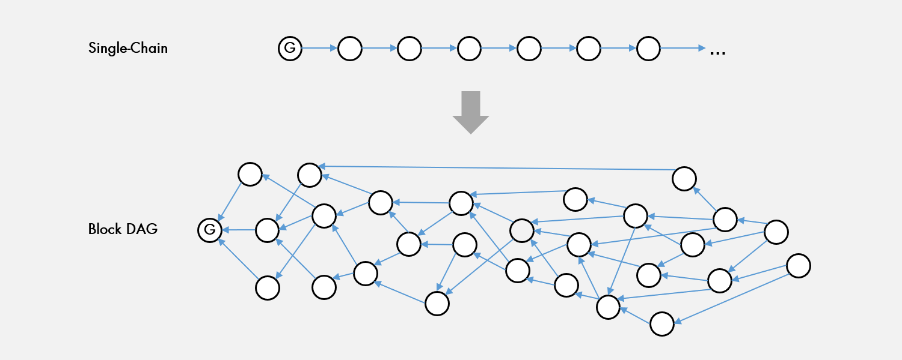

# Dafecs Architecture

## [2. Core Consensus](https://docs.dafecs.com/tech-whitepaper/dafecs-architecture#2-core-consensus) 

### [2.1 Brief Background](https://docs.tdafecs.com/tech-whitepaper/dafecs-architecture#2-1-brief-background)

As the blockchain space matures, pioneering networks such as Bitcoin and Ethereum have run into scalability bottlenecks. One of the key scalability metrics is total network throughput, usually measured by transactions per second \(TPS\). For single-chain topologies, however, increasing TPS necessarily means a decrease in security, the recovery of which negates any TPS gains.

To increase TPS, the network could increase block size β and/or block generation rate γ. Increasing β necessarily increases network delay δ, because a bigger block of data takes longer to transmit. This in turn reduces the timeliness with which all nodes hear about the block, thus increasing the likelihood of branching. Increasing γ has the effect of increasing the number of blocks proposed on the network, but since only a single block can ever be accepted with a single-chain topology, more blocks actually increases the options nodes have to make the incorrect bet on the longest chain, leading to branching. Hence, we see a hard tradeoff between TPS and security [\[2\]](https://docs.dafecs.com/tech-whitepaper/further-reading#2-y-sompolinsky-and-a-zohar-secure-high-rate-transaction-processing-in-bitcoin-31-december-2013-online-available-https-eprint-iacr-org-2013-881-pdf-accessed-30-april-2019). The loss of security is attributable to the fact that honest nodes are not coordinated, whereas as a malicious adversary can coordinate off-chain to produce a branch-free set of blocks and thus determine the longest chain.

* **βγ ∝ TPS**: block size and block generation increase TPS
* **β ∝ δ**: block size increase network delay 
* **δγ ∝ branching**: network delay and block generation increase branching \(decreases security\)

One elegantly simple approach is to abandon the single-chain approach and adopt an inclusive approach in the form of a DAG [\[3\]](https://docs.dafecs.com/tech-whitepaper/further-reading#3-y-sompolinsky-and-a-zohar-phantom-ghostdag-two-scalable-blockdag-protocols-2018-online-available-https-eprint-iacr-org-2018-104-pdf-accessed-17-december-2018), or specifically a block DAG. In a block DAG, blocks could be proposed by multiple nodes and they would all be accepted if they were valid. Additionally, unlike in a single-chain topology, each block could reference not just a single parent, but multiple parents – in fact as many parents as the proposing node sees tips in their current view of the DAG. A critical property of such a DAG is that that it removes the hard tradeoff between TPS and security, as the network could reliably increase β without sacrificing security. To see why this is, recall that increasing β would lead to an increase in branching. However, instead of following the simple longest chain rule of a linear blockchain, the acknowledged parent and tips recorded into each block be used to provide crucial information for block ordering. Without the additional overhead of voting, the ability for one block to point to another is a de-facto vote that the blocks referenced as parents and tips should be ordered ahead of the new block. This key property can be combined by the use of the GHOST rule to create an inclusive block protocol that maintains security independent from branching rate [\[3\]](https://docs.dafecs.com/tech-whitepaper/further-reading#3-y-sompolinsky-and-a-zohar-phantom-ghostdag-two-scalable-blockdag-protocols-2018-online-available-https-eprint-iacr-org-2018-104-pdf-accessed-17-december-2018).

However, the block DAG topology isn’t without its own set of challenges, here are a few:

* Ordering convergence
* Finality \(confirmation latency\)
* Block efficiency - overlapping block contents

Taraxa sets out to address these issues.

